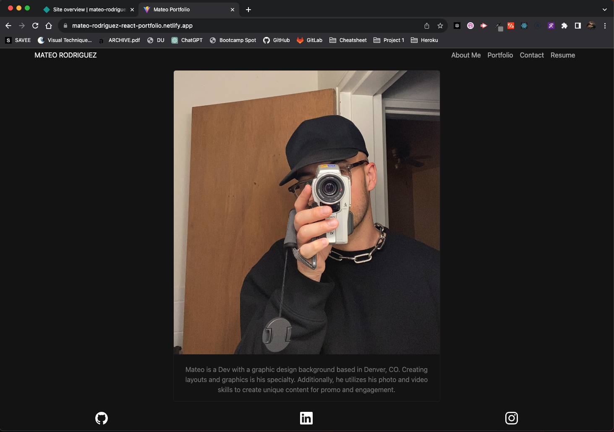

# mateo-react-portfolio

Developed under 

## Description

This is my react portfolio website which you can visit by clicking [here.](https://mateo-rodriguez-react-portfolio.netlify.app/)

## Screenshot

## Table of Contents

- [Installation](#installation)
- [Usage](#usage)
- [Contribution](#contribution)
- [Test](#test)
- [License](#license)
- [Questions](#questions)

## Installation

Clone the repo, run `npm i`, run `npm run dev`.

## Usage

This is webiste used to tell more about myself and my work.

## Contribution

Just email me.

## Test

Just try it out.

## License

A short and simple permissive license with conditions only requiring preservation of copyright and license notices. Licensed works, modifications, and larger works may be distributed under different terms and without source code.

[MIT link](https://choosealicense.com/licenses/mit/)

## Questions

Submit questions to mateo.rodriguez85@gmail.com

View my Github profile at https://github.com/AztekAsylum
